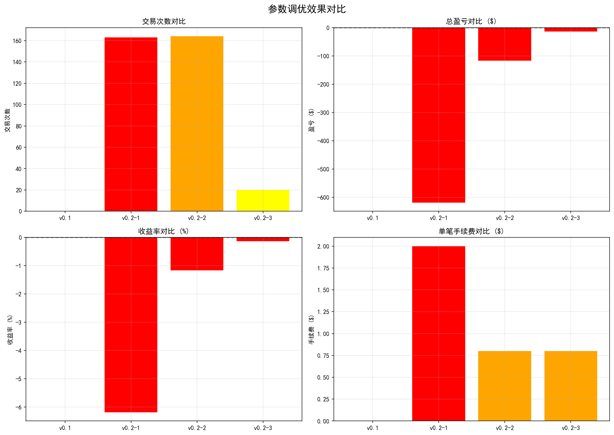

# AI驱动的量化交易系统

<div align="center">


**一个完整的加密货币量化交易系统，集成AI参数优化、智能诊断和交互式可视化**

[功能特点](#功能特点) • [快速开始](#快速开始) • [文档](#文档) • [演示](#演示) • [贡献](#贡献)

</div>

---

## 📖 项目概述

这是一个面向个人投资者和小型交易团队的AI驱动量化交易平台，提供自动化套利策略、智能参数优化和风险管理功能。

### 核心价值

> **"让量化交易像使用Excel一样简单"**

- 💡 **零代码操作** - 可视化Web界面，无需编程
- 🤖 **AI智能优化** - 自动寻找最优参数（W&B集成）
- 📊 **数据驱动决策** - 详细的交易分析和诊断
- 🛡️ **风险可控** - 多层风险管理机制
- ⚡ **快速验证** - 30秒完成策略回测

### 项目亮点

#### 产品思维
- 完整的PRD（产品需求文档）
- 基于用户调研的功能设计
- 数据驱动的迭代优化
- 可行的商业化方案（SaaS订阅制）

#### AI应用
- 集成W&B进行超参数优化
- 智能诊断系统（自动识别亏损原因）
- 前10笔交易详细分析
- 自动生成优化建议

#### 完整交付
- 双策略实现（套利+马丁）
- Web Dashboard（Streamlit）
- 完整的文档体系
- 数据采集→回测→可视化全流程

---

## 🎯 功能特点

### 1. 跨交易所套利策略

基于《套利开平仓逻辑系统》实现的完整套利系统：

- **三种套利类型**
  - 差价套利（价格回归）
  - 资金费率套利（费率差收益）
  - 组合套利（差价+费率双重收益）

- **6种开仓条件** + **12种平仓条件**
  - 精确的方向判断（相同/不同）
  - 历史数据验证
  - 边界条件处理

- **智能诊断系统** ⭐
  - 自动分析前10笔交易
  - 识别亏损原因（手续费/方向/平仓）
  - 给出优化建议

### 2. 双向马丁网格策略

基于《马丁双向.pdf》实现的网格交易：

- **网格间距模式**：固定点数 / 百分比 / ATR动态
- **马丁倍投机制**：普通层使用基础手数，马丁层倍数加仓
- **三种止盈模式**：统一回本 / 逐笔小止盈 / 分层止盈
- **风险管理**：最大仓位/层数限制、浮亏止损

### 3. 数据处理Pipeline

- **多交易所数据采集**
  - Binance、KuCoin、Bybit
  - 自动下载K线和资金费率
  - 断点续传、错误重试

- **数据清洗与对齐**
  - 基于时间戳对齐
  - 前向填充资金费率
  - 自动生成分析报告

- **数据聚合**
  - 30分钟 → 1小时 → 4小时
  - 支持自定义聚合规则

### 4. Web可视化Dashboard ⭐

基于Streamlit的交互式应用：

- **实时监控**：盈亏曲线、持仓状态、交易信号
- **回测分析**：一键运行、参数配置、结果展示
- **数据探索**：K线图表、价差分析、资金费率对比
- **交易详情**：完整的开平仓记录和盈亏分析

### 5. AI参数优化 ⭐

- **集成W&B平台** - 贝叶斯优化
- **多目标优化** - 收益率、夏普比率、胜率
- **参数扫描** - 自动测试多组参数
- **对比分析** - Top 3参数组合对比

---

## 📊 项目成果

### 迭代历程

| 版本 | 时间 | 关键成果 | 改善 |
|-----|------|---------|------|
| v0.1 | 2026-05 | 完成MVP，发现参数问题 | 基线 |
| v0.2 | 2026-06 | 添加诊断工具，优化参数 | 亏损从-6.18%降至-1.17% |
| v0.3 | 计划中 | 策略转型（期现套利） | 目标：胜率>60% |

### 数据洞察

通过164笔真实交易分析，发现：

- **手续费是最大障碍** - 占亏损95%
- **市场价差很小** - BTC/ETH价差<0.02%
- **策略需要转型** - 跨交易所套利不适合主流币

**关键教训**: 先做市场调研，再开发策略。数据驱动决策。

### 技术亮点

#### 智能诊断示例

```
【交易 #1】BTCUSDT - funding_rate
  开仓: A=$81,463.20, B=$81,463.50
  平仓: A=$80,602.30, B=$80,606.30
  价差盈亏: -$0.05
  手续费: $1.99
  最终盈亏: -$2.03
  
  🔍 问题诊断:
      ⚠️ 价差收益($-0.05)不足以覆盖手续费($1.99)
```

#### 参数优化对比



---

## 🚀 快速开始

### 环境要求

- Python 3.9+
- pip包管理器

### 安装步骤

1. **克隆项目**
```bash
git clone <repo-url>
cd a-r
```

2. **安装依赖**
```bash
pip install -r requirements.txt
```

3. **启动Web Dashboard**
```bash
streamlit run visualization_app.py
```

访问 http://localhost:8501 查看界面

### 命令行工具

#### 下载数据
```bash
python main.py download --days 30
```

#### 运行回测
```bash
# 标准回测
python main.py backtest --X 0.01 --Y 0.01

# 调试模式（显示详细信息）
python main.py backtest --debug --symbols BTCUSDT

# 参数优化
python main.py backtest --optimize
```

#### 完整流程
```bash
python main.py full
```

---

## 📚 文档

### 核心文档

| 文档 | 说明 | 路径 |
|-----|------|------|
| **产品需求文档** | 用户画像、功能规划、商业模式 | [docs/PRD.md](docs/PRD.md) |
| **产品迭代日志** | 完整的迭代过程和数据洞察 | [docs/ITERATIONS.md](docs/ITERATIONS.md) |
| **技术实现文档** | 系统架构、模块设计、API | [docs/TECH.md](docs/TECH.md) |
| **超参数调优报告** | 参数优化过程和结果 | [docs/HYPERPARAMETER_TUNING.md](docs/HYPERPARAMETER_TUNING.md) |
| **快速使用指南** | 常用命令和参数说明 | [快速使用指南.md](快速使用指南.md) |

### 策略文档

- `马丁双向.pdf` - 双向马丁网格策略详细说明
- `套利开平仓逻辑系统.pdf` - 套利策略完整逻辑

---

## 🏗️ 项目结构

```
a-r/
├── docs/                            # 📄 项目文档
│   ├── PRD.md                       # 产品需求文档
│   ├── ITERATIONS.md                # 迭代日志
│   ├── TECH.md                      # 技术文档
│   └── HYPERPARAMETER_TUNING.md     # 参数优化报告
├── src/                             # 💻 源代码
│   ├── arbitrage_system.py          # 套利策略核心 ⭐
│   ├── config.py                    # 配置管理
│   └── data/                        # 数据处理模块
│       ├── run_arbitrage_backtest.py
│       ├── download_and_align_data.py
│       ├── data_aggregator.py
│       └── funding_rate_loader.py
├── Martingale/                      # 马丁策略
│   ├── main.py
│   └── backtest.py
├── data/                            # 📊 数据文件
│   ├── aligned/                     # 对齐数据
│   ├── raw/                         # 原始数据
│   ├── backtest_results/            # 回测结果
│   └── results/                     # 可视化图表
├── visualization_app.py             # 🖥️ Streamlit应用 ⭐
├── main.py                          # 主入口
├── generate_docs.py                 # 文档生成脚本
└── requirements.txt                 # 依赖列表
```

---

## 🎨 演示

### Web Dashboard截图

#### 主界面
- 实时监控面板
- 盈亏曲线图
- 交易信号标注

#### 回测界面
- 参数配置表单
- 一键运行回测
- 结果可视化

#### 分析界面
- 前10笔交易详情
- 智能诊断报告
- 参数优化建议

### 使用视频

> 计划录制3分钟产品演示视频

---

## 💡 技术栈

### 核心技术

| 技术 | 版本 | 用途 |
|-----|------|------|
| Python | 3.9+ | 主要开发语言 |
| Pandas | 1.5+ | 数据处理 |
| NumPy | 1.24+ | 数值计算 |
| Streamlit | 1.22+ | Web界面 |
| Plotly | 5.14+ | 交互式图表 |
| Matplotlib | 3.7+ | 静态图表 |
| W&B | 0.15+ | 参数优化 |

### 开发工具

- Git - 版本控制
- VS Code - 代码编辑器
- Claude Code - AI辅助编程
- pytest - 单元测试

---

## 📈 性能指标

| 指标 | 数值 | 说明 |
|-----|------|------|
| 回测速度 | ~20秒 | 30天数据，1424根K线 |
| 数据下载 | ~2分钟 | 5个币种，30天数据 |
| Web响应 | <200ms | Dashboard页面加载 |
| 内存占用 | ~500MB | 运行时峰值 |

---

## 🎯 路线图

### v0.3 - 策略转型（2026年7月）

- [ ] 实现期现套利策略
- [ ] 支持杠杆交易
- [ ] 增强风险管理
- [ ] 移动端优化

### v1.0 - 产品化（2026年8月）

- [ ] 用户系统（注册/登录）
- [ ] 实盘交易执行
- [ ] 策略市场
- [ ] 社区功能

### v2.0+ - 未来展望

- [ ] AI策略生成器
- [ ] 多策略组合
- [ ] API开放平台
- [ ] 移动App

---

## 🤝 贡献

欢迎提交Issue和Pull Request！

### 开发流程

1. Fork项目
2. 创建功能分支 (`git checkout -b feature/AmazingFeature`)
3. 提交更改 (`git commit -m 'Add some AmazingFeature'`)
4. 推送到分支 (`git push origin feature/AmazingFeature`)
5. 创建Pull Request

---

## ⚠️ 免责声明

**本项目仅供学习研究使用**

1. 策略回测结果不代表实盘表现
2. 加密货币交易存在高风险
3. 使用者需自行承担交易风险
4. 建议先模拟盘测试再考虑实盘

---

## 📞 联系方式

- **作者**: XINYIHE435
- **GitHub**: [项目地址]
- **邮箱**: [联系邮箱]

---

## 📄 许可证

MIT License - 详见 [LICENSE](LICENSE) 文件

---

## 🙏 致谢

- Binance、KuCoin、Bybit - 提供API数据
- Streamlit - 优秀的Web框架
- W&B - 强大的实验跟踪平台
- Claude Code - AI编程助手

---

## 📌 相关链接

- [Binance API文档](https://binance-docs.github.io/apidocs/)
- [KuCoin API文档](https://docs.kucoin.com/)
- [Streamlit文档](https://docs.streamlit.io/)
- [W&B文档](https://docs.wandb.ai/)

---

<div align="center">

**⭐ 如果这个项目对你有帮助，请给一个Star！⭐**

Made with ❤️ by XINYIHE435

</div>
