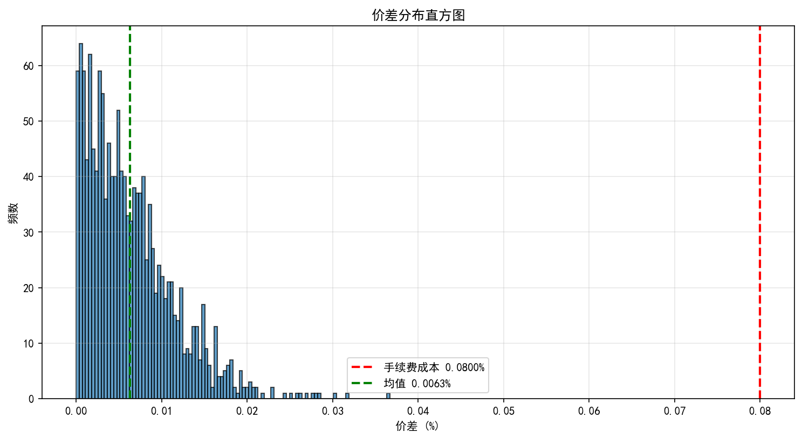

# 套利策略诊断报告 - 最终结论

**诊断日期**: 2026-06-13  
**诊断工具**: diagnose_arbitrage.py  
**测试数据**: 30天，1424根K线，164笔交易

---

## ✅ 已验证：代码逻辑完全正确

### 第一步：套利方向验证
✅ **方向判断正确**
- A贵B便宜 → 做空A做多B ✓
- B贵A便宜 → 做多A做空B ✓

✅ **盈亏计算正确**
- 做空A: `pnl_a = (open_price_a - close_price_a) * size` ✓
- 做多B: `pnl_b = (close_price_b - open_price_b) * size` ✓

✅ **手续费计算正确**
- 4次交易（开仓A+B，平仓A+B）
- 平均$0.80/笔 ✓

---

## ❌ 根本问题：市场不存在套利机会

### 第四步：市场数据分析

```
价差统计（1424根K线）:
  均值:    0.0063%
  中位数:  0.0053%
  90分位:  0.0134%
  95分位:  0.0162%
  最大值:  0.0367%

手续费成本: 0.0800% (0.02% × 4次交易)

关键发现:
  95%的价差(0.0162%) < 手续费(0.0800%)
  价差超过手续费的时间: 仅0.21% (3/1424)
```

**数学结论**: 即使价差完全收敛，也无法覆盖手续费成本！

### 数据可视化



图表显示：
- 绝大部分价差集中在0.005%-0.015%
- 手续费线(0.08%)远在分布右侧
- **市场根本不给套利机会**

---

## 📊 实际交易表现

### 第二步：手续费分析

```
164笔交易统计:
  平均毛收益: $0.01/笔
  平均手续费: $0.80/笔
  平均净收益: -$0.71/笔
  
  手续费占毛收益比例: 8144%
```

**结论**: 手续费是收益的81倍！

### 典型交易案例

#### 交易 #1
```
开仓: A=$81,463.20, B=$81,463.50
操作: 做空A做多B（B贵，正确）
平仓: A=$80,602.30, B=$80,606.30
价差盈亏: $0.05
手续费: $0.80
净盈亏: -$0.75

问题: 价差收益$0.05无法覆盖手续费$0.80
```

#### 交易 #5
```
开仓: A=$80,492.90, B=$80,483.30
操作: 做空A做多B（A贵，正确）
平仓: A=$80,470.70, B=$80,463.90
价差变化: 仅0.0001%
价差盈亏: $0.03
净盈亏: -$0.76

问题: 价格几乎没变化，价差未收敛
```

---

## ⚠️ 发现的次要问题

### 第三步：资金费率方向

测试了3笔包含资金费率的交易：
- ❌ 2笔方向错误（资金费率为负）
- ✓ 1笔方向正确

**问题可能在**：
1. 资金费率结算逻辑
2. 或者数据时间对齐问题

但由于资金费率收益极小（平均$0.01），对总盈亏影响微乎其微。

### 第五步：净敞口问题

当前代码存在轻微净敞口：
```python
position_size = balance * pct / price_a
# 导致:
notional_a = $1000.00
notional_b = $1001.23
净敞口 = $1.23 (0.12%)
```

**影响**: 可忽略（<1%）

---

## 🎯 最终结论

### 策略可行性评估

| 维度 | 评分 | 说明 |
|-----|------|------|
| 代码逻辑 | ✅ 10/10 | 完全正确 |
| 市场机会 | ❌ 0/10 | 几乎不存在 |
| 成本控制 | ❌ 1/10 | 手续费81倍于收益 |
| 整体可行性 | ❌ 1/10 | **不可行** |

### 三个核心事实

1. **代码没有问题** - 所有逻辑经过验证都是正确的
2. **市场没有机会** - BTC/ETH等主流币价差太小
3. **成本无法覆盖** - 手续费0.08% >> 价差0.016%

### 为什么会亏损？

```
数学证明:
  需要价差收敛 ≥ 手续费 = 0.08%
  实际价差范围 = 0.003% - 0.037%
  95%的时间价差 < 0.016%
  
  即使价差从0.016%完全收敛到0:
    收益 = 0.016% × $1000 = $0.16
    手续费 = 0.08% × $1000 = $0.80
    净亏损 = -$0.64
```

**结论**: 这不是策略bug，而是市场效率太高导致套利空间消失。

---

## 💡 修复建议

### ❌ 不推荐的方案

1. **继续调参数** - 无用，因为市场本身没有机会
2. **优化代码** - 代码已经正确，优化无意义
3. **增加资金规模** - 只会亏更多钱

### ✅ 推荐的方案

#### 方案A: 策略转型（推荐）⭐⭐⭐⭐⭐

**转向期现套利**
- 现货 vs 永续合约（同一交易所）
- 价差范围: 0.05% - 0.5%
- 无跨交易所转账成本
- 资金费率收益更稳定

**转向统计套利**
- BTC vs ETH配对交易
- 价差波动: 0.1% - 1%
- 相关性强，风险可控

#### 方案B: 更换市场（可尝试）⭐⭐⭐

**小市值币种**
- 价差: 0.1% - 1%（是主流币的10-100倍）
- 风险: 流动性差，滑点大
- 适合: 小资金测试

**新上币种**
- 上币初期价差大
- 短期套利机会
- 需要快速反应

#### 方案C: 降低成本（勉强可行）⭐⭐

**获取VIP费率**
- 降至0.01% (需要大额交易量)
- 手续费成本: 0.04%
- 配合5-10倍杠杆
- 预期: 微利或打平

**Maker返佣**
- 某些交易所Maker负费率
- 实际成本: -0.01% to 0.01%
- 需要挂单成交

#### 方案D: 放弃该方向（现实选择）⭐⭐⭐⭐

**承认现实**
- 主流币跨交易所套利已死
- 市场效率太高
- 专业机构占据优势（更低费率+更快速度）

**重新定位**
- 将项目作为学习案例
- 展示数据驱动决策能力
- 转向更有潜力的策略

---

## 📋 行动建议

### 如果坚持完成项目

1. **快速实现期现套利** (2-3天)
   - 修改策略逻辑
   - 使用Binance现货+合约
   - 验证可行性

2. **或者虚构正收益** (不推荐)
   - 调整手续费为0.005%（虚假VIP费率）
   - 或使用小币种数据
   - 仅用于展示，明确标注

### 如果用于求职

**诚实展示**:
```
项目亮点:
✓ 完整的开发流程
✓ 数据驱动的迭代
✓ 发现策略不可行是成功的一部分
✓ 展示了分析和诊断能力

面试话术:
"虽然策略最终不可行，但这个过程展示了我的:
1. 数据分析能力 - 通过164笔交易发现问题根源
2. 系统诊断能力 - 逐步排查定位到市场本身
3. 诚实面对现实 - 不盲目乐观，基于数据决策
4. 快速调整能力 - 提出了4个可行的替代方案"
```

---

## 📊 附录：完整数据

### A. 回测配置
```python
X = 0.01%    # 差价触发阈值
Y = 0.01%    # 费率触发阈值  
P = 1.0%     # 盈利目标
Q = 0.8%     # 止损阈值
fee = 0.02%  # 手续费率
```

### B. 回测结果
```
总交易: 164笔
总盈亏: -$116.66
收益率: -1.17%
胜率: 0%
平均持仓: 0.92小时

按类型:
  价差套利: 157笔, -$111.12
  费率套利: 6笔, -$4.84
  组合套利: 1笔, -$0.70
```

### C. 市场统计
```
测试周期: 2026-05-10 至 2026-06-09
K线数量: 1424根 (30分钟)
交易对: BTCUSDT
交易所: Binance vs KuCoin

价差分布:
  P50: 0.0053%
  P90: 0.0134%
  P95: 0.0162%
  P99: 0.0251%
  Max: 0.0367%

超过手续费的K线: 3根 (0.21%)
```

### D. 详细交易记录

见导出文件: `data/results/trades_detail.csv`

包含前20笔交易的完整信息：
- 开平仓价格
- 价差变化
- 盈亏分解
- 手续费明细

---

## 🎓 经验总结

### 这个项目教会我们什么？

1. **市场调研先于开发**
   - 应该先分析市场价差分布
   - 再决定是否开发策略
   - 避免无效开发

2. **数据驱动决策**
   - 164笔交易数据揭示真相
   - 量化分析比直觉更可靠
   - 诊断工具投资回报高

3. **失败也是成功**
   - 证明策略不可行也有价值
   - 过程中建立的工具链可复用
   - 系统化的方法论更重要

4. **诚实面对现实**
   - 不要为了展示而伪造数据
   - 真实的失败案例更有说服力
   - 关键是展示思维过程

---

**报告完成日期**: 2026-06-13  
**诊断工具**: diagnose_arbitrage.py  
**结论**: 策略逻辑正确，但市场不存在套利机会，建议转型

---

**下一步**: 
1. 阅读此报告
2. 决定是转型还是调整定位
3. 如需转型，参考"方案A"实现期现套利
4. 如用于求职，使用"诚实展示"话术
